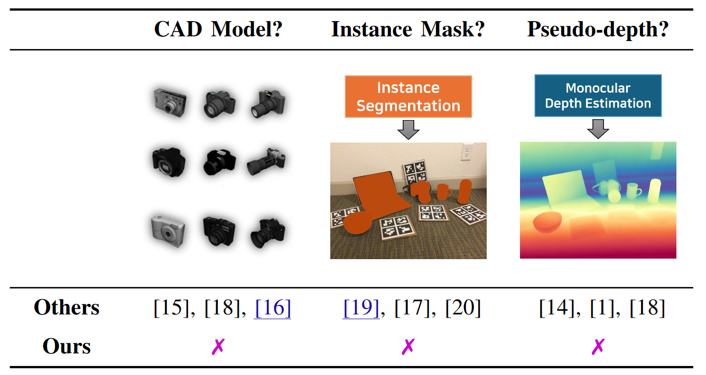
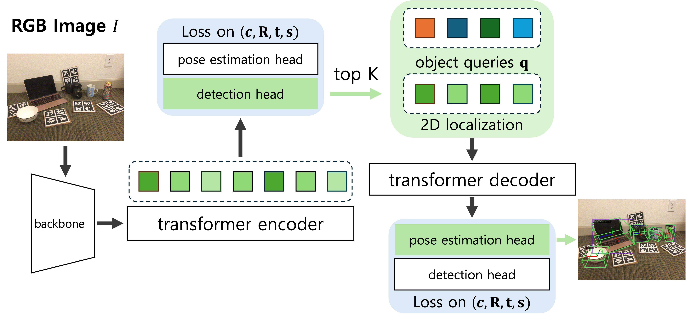

<figure class="image is-16by9">
    <iframe class="has-ratio" src="https://www.youtube.com/embed/m1LqzAMNJiU" title="YOPO Project Video" frameborder="0" 
    allow="accelerometer; autoplay; clipboard-write; encrypted-media; gyroscope; picture-in-picture" allowfullscreen></iframe>
</figure>

<!-- Using HTML to center the abstract -->
<div class="columns is-centered has-text-centered">
    <div class="column is-four-fifths">
        <h2>Abstract</h2>
        <div class="content has-text-justified">
Accurately recovering the full 9-DoF pose of unseen instances within specific categories from a single RGB image remains a core challenge for robotics and automation.
Most existing solutions still lean on pseudo-depth, CAD models, or multi-stage cascades that separate 2D detection from pose estimation.
Motivated by the need for a simpler, RGB-only alternative that learns directly at the category level, we revisit a longstanding question: <em>Can object detection and 9-DoF pose estimation be unified with high performance, without any additional data?</em>
We show that they can be achieved with our <strong>YOPO</strong>, a single-stage, query-based framework that treats category-level 9-DoF estimation as a natural extension of 2D detection.
YOPO augments a transformer detector with a lightweight pose head, a bounding-box–conditioned translation module, and a 6D–aware Hungarian matching cost.
The model is trained end-to-end only with RGB images and pose labels.
Despite its minimalist design, YOPO sets a new SOTA on three benchmarks. On REAL275 dataset, it achieves 79.6% IoU$_{50}$ and 54.1% under the $10^\circ 10\,\mathrm{cm}$ metric, surpassing all prior RGB-only methods and closing much of the gap to RGB-D systems.
Code and pretrained models will be released.
        </div>
    </div>
</div>

---

# Introduction



Estimating an object’s 6‑D (or, for unknown scale, 9‑D) pose from a single RGB frame is essential for robotic grasping, AR, and autonomous navigation. Most prior <em>category‑level</em> methods rely on extra geometric cues—CAD models, instance masks, or pseudo‑depth—plus two‑stage pipelines that first detect and then crop each object. 

We asks: **Can we remove all that baggage?**

#### Objective
Develop a <strong>single‑stage</strong>, <strong>RGB‑only</strong> model that:
1. Detects every object in the scene,  
2. Predicts its full 9‑D pose <em>(rotation R, translation t, scale s)</em>,  
3. Trains and infers without CAD, masks, or depth.

---
# Key Ideas
1. **Query‑based DETR backbone** – inherits DINO’s two‑stage refinement to get strong 2‑D detections.  
2. **Parallel pose head** – four MLP branches regress center‑offset, depth, rotation (6‑D rep) and scale.  
3. **Box‑conditioned translation** – concatenates the 2‑D bounding box to the query so depth & offset learn geometric context.  
4. **3‑D‑aware Hungarian matching** – assigns predictions with a cost that mixes classification, IoU, translation & rotation.  
5. **Minimal supervision** – 2‑D boxes are auto‑derived by projecting 3‑D cuboids; no extra labels required.



**Table. Comparison of methods on additional data requirements / model pipeline**

| Method | CAD Model? | Seg. Mask? | Pseudo-depth? | End-to-end?
|:---|:-:|:-:|:-:|:-:|
| Synthesis (ECCV '20) | **✓** | **✓** | **✗** | **✗**
| MSOS (RA-L '21) | ✓ | ✓ | ✗ | ✗
| CenterSnap (ICRA '22) | ✓ | ✗ | ✗ | ✓
| OLD-Net (ECCV '22) | ✓ | ✗ | ✓ | ✗
| FAP-Net (ICRA '24) | ✓ | ✓ | ✓ | ✗
| DMSR (ICRA '24) | ✓ | ✓ | ✓ | ✗
| LaPose (ECCV '24) | ✓ | ✓ | ✗ | ✗
| MonoDiff9D (ICRA '25) | ✗ | ✓ | ✓ | ✗
| DA-Pose (RA-L '25) | ✗ | ✓ | ✓ | ✗
| GIVEPose (CVPR '25) | ✓ | ✓ | ✗ | ✗
| **YOPO (Ours)** | ✗ | ✗ | ✗ | ✓

YOPO is the **only** approach in this list that dispenses with <em>all</em> external cues.

#### Significance
* **Performance.** On REAL275, YOPO‑Swin‑L tops RGB baselines with **79.1%  IoU<sub>50</sub>** and **56.1%  under the 10°/10cm**  metric.
* **Simplicity.** Training uses just images + 9‑D labels—no costly CAD collections or instance segmentation.  
* **Scalability.** The same architecture generalises across CAMERA25 (synthetic), REAL275 (real) and HouseCat6D (10 categories).  
* **Speed.** One forward pass ≈ <em>real‑time</em> (**21.3 FPS** @ A6000, YOPO R50) inference suitable for robotic manipulation loops.

---
# Experiments

**Table. Comparison on the REAL275 dataset. All methods use only RGB input.**

| Method | IoU<sub>50</sub> | IoU<sub>75</sub> | 10 cm | 10° | 10°/10 cm |
|:-|:---:|:---:|:---:|:---:|:---:|
| Synthesis (ECCV '20) | - | - | 34.0 | 14.2 | 4.8 |
| MSOS (RA-L '21) | 23.4 | 3.0 | 39.5 | 29.2 | 9.6 |
| CenterSnap-RGB (ICRA '22) | 31.5 | - | - | - | 30.1 |
| OLD-Net (ECCV '22) | 25.4 | 1.9 | 38.9 | 37.0 | 9.8 |
| FAP-Net (ICRA '24) | 36.8 | 5.2 | 49.7 | 49.6 | 24.5 |
| DMSR (ICRA '24) | 28.3 | 6.1 | 37.3 | 59.5 | 23.6 |
| LaPose (ECCV '24) | 17.5 | 2.6 | 44.4 | - | 30.5 |
| MonoDiff9D (ICRA '25) | 31.5 | 6.3 | 41.0 | 56.3 | 25.7 |
| DA-Pose (RA-L '25) | 28.1 | 3.6 | 45.8 | 27.5 | 13.4 |
| GIVEPose (CVPR '25) | 20.1 | - | 45.9 | - | 34.2 |
| **YOPO R50 (Ours)** | 67.1 | 16.6 | 75.6 | 54.0 | 40.7 |
| **YOPO Swin-L (Ours)** | 71.6 | 16.4 | 77.8 | **67.6** | 52.8 |
| **YOPO* Swin-L (Ours)** | **79.6** | **19.6** | **84.4** | 66.0 | **54.1** |

<section class="hero is-light is-small">
  <div class="hero-body">
    <div class="container">
      <h3 class="title is-4 has-text-centered">Sample Results on REAL275 test Scenes</h3>
      <div id="results-carousel" class="carousel results-carousel">
        <div class="item">
          <video autoplay controls muted loop playsinline width="100%">
            <source src="./static/videos/comparison_video_scene_1.mp4" type="video/mp4">
            Your browser does not support the video tag.
          </video>
        </div>
        <div class="item">
          <video autoplay controls muted loop playsinline width="100%">
            <source src="./static/videos/comparison_video_scene_2.mp4" type="video/mp4">
            Your browser does not support the video tag.
          </video>
        </div>
        <div class="item">
          <video autoplay controls muted loop playsinline width="100%">
            <source src="./static/videos/comparison_video_scene_3.mp4" type="video/mp4">
            Your browser does not support the video tag.
          </video>
        </div>
        <div class="item">
          <video autoplay controls muted loop playsinline width="100%">
            <source src="./static/videos/comparison_video_scene_4.mp4" type="video/mp4">
            Your browser does not support the video tag.
          </video>
        </div>
        <div class="item">
          <video autoplay controls muted loop playsinline width="100%">
            <source src="./static/videos/comparison_video_scene_5.mp4" type="video/mp4">
            Your browser does not support the video tag.
          </video>
        </div>
      </div>
    </div>
  </div>
</section>

## Citation
```
@article{lee2025yopo,
  title     = {You Only Pose Once: A Minimalist’s Detection Transformer for Monocular RGB Category-level 9D Multi-Object Pose Estimation},
  author    = {Hakjin Lee and Junghoon Seo and Jaehoon Sim},
  journal   = {arXiv preprint arXiv:????.?????},
  year      = {2025}
}
```
